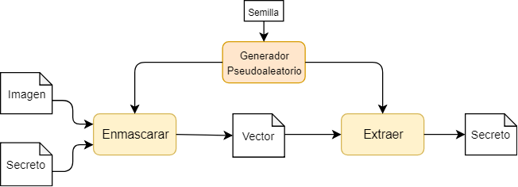
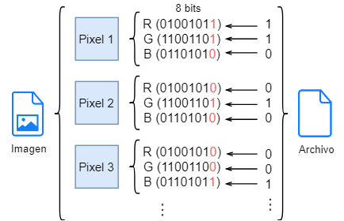
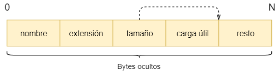

# Estenografía en imágenes


Herramienta escrita en Python que implementa el método de estenográfico de sustitución del bit menos significativo en cada pixel de una imagen compatible.

Hay dos operaciones principales, enmascarar el archivo en la imagen, y extraer de una imagen previamente modificada el archivo oculto.

Para poder extraer un archivo en una imagen modificada, es necesario que la semilla de inicialización sea la misma para el proceso de generación como de extracción.

## Uso
1. Generar la imagen modificada, indicando la ruta de la imagen vector y el archivo secreto en este caso otra imagen. Transcurrido un tiempo, se generará una nueva imagen modificada.
```shell
$ python3 src/estenografia.py enmascarar -v candado.png -a gato.jpg

Ruta vector: candado.png
Imagen vector: PNG (1000, 1000) RGB

Ruta archivo: gato.jpg
Tamaño secreto: 27311 Bytes
Tamaño secreto (con cabecera): 27326 Bytes

Tamaño límite enmascarable: 375000 Bytes
Píxeles necesarios para enmascarar: 72870

Cargando imagen vector
Cargando mapa de bits del secreto
Creado imagen resultante
Cargando imagen resultante

Semilla: 10
Generando 1000000 posiciones aleatorias
Modificando píxeles

Imagen resultante: candado_vector.png
```

2. Una vez generado la imagen vector, podemos enviarla y extraer la información oculta, indicando la ruta de la imagen. Una vez finalizado tendremos de nuevo el archivo oculto.

```shell
$ python3 src/estenografia.py extraer -v vector.png

Ruta vector: vector.png
Imagen vector: PNG (1000, 1000) RGB
Cargando imagen vector

Semilla: 10
Generando 1000000 posiciones aleatorias

Extrayendo bits
Convirtiendo a bytes
Cabecera: b'gato:jpg:27311:\xff\xd8\xff\xe0\x00\x10JFIF'

Generando archivo: gato_oculto.jpg
```
## Sustitución bit menos significativo (LSB)
Método más común de enmascaramiento, en el que cada valor menos significativo del canal de pixel se sustituye por un valor del archivo a ocultar, este proceso se puede ilustrar en el siguiente diagrama. Para no hacer secuencial el proceso, utilizamos un generador de posiciones pseuoaleatorias.



Si solo dibujamos los píxeles que contienen información y dejamos los demas en color negro, podemos observar la distribución pseudoaleatoria del generador.


## Formatos de imagen compatibles
- PNG
- BMP
- TIFF
- ICO

## Formato archivo enmascarado
Para poder recuperar convenientemente el archivo oculto, es necesario añadir metadatos que no lo contienen en su carga, estos son muy simples como el nombre y extensión del archivo, tamaño en bytes, y el propio archivo. El número de bytes nos ayuda a localizar donde acaba el archivo.



## Instalar dependencias
```shell
$ pip install -r requirements.txt
```

## Modulos utilizados
- Pillow, fork de PIL (Python Imaging Library)

## Ayuda
1. Ayuda general de la herramienta.
```shell
$ python3 src/estenografia.py -h
usage: esteno.py [-h] {enmascarar,extraer} ...

Herramienta de estenografía, sobre una imagen se oculta un archivo

positional arguments:
  {enmascarar,extraer}
    enmascarar          Enmascarar archivo secreto en una imagen vector
    extraer             Extraer archivo secreto de una imagen vector

optional arguments:
  -h, --help            show this help message and exit
```

2. Ayuda del comando enmascarar.
```shell
$ python3 src/estenografia.py enmascarar -h
usage: esteno.py enmascarar [-h] -v VECTOR [-a ARCHIVO] [-s SEMILLA]
                            [--ruido]

optional arguments:
  -h, --help            show this help message and exit
  -v VECTOR, --vector VECTOR
                        Ruta de la imagen vector
  -a ARCHIVO, --archivo ARCHIVO
                        Ruta del archivo secreto
  -s SEMILLA, --semilla SEMILLA
                        Semilla de inicialiazción del generador
  --ruido               Añadir ruido a los píxeles no modificados
```

3. Ayuda del comando extraer.
```shell
$ python3 src/estenografia.py extraer -h
usage: esteno.py extraer [-h] -v VECTOR [-s SEMILLA]

optional arguments:
  -h, --help            show this help message and exit
  -v VECTOR, --vector VECTOR
                        Ruta de la imagen vector
  -s SEMILLA, --semilla SEMILLA
                        Semilla de inicialiazción del generador
```